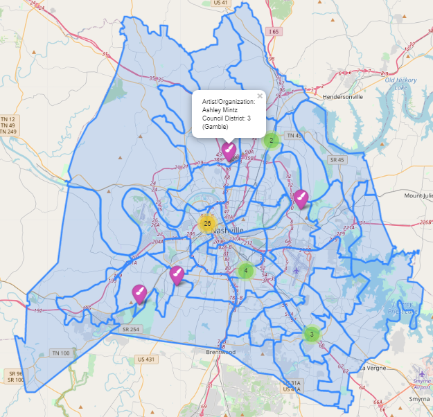

# THRIVE Art Projects by Council District

## Description
The main product of this repository is the Jupyter Notebook that explores, merges, and maps two data sets: the locations of THRIVE art projects and the boundaries of Nashville Metro Council Districts. According to the [Metro Arts website](https://www.metroartsnashville.com/thrive), "Thrive connects artists and organizations with the community to create neighborhood investments and transformations. By offering funding opportunities outside of the traditional grants process, Thrive empowers artists and organizations to build, strengthen and cultivate communities in Davidson County." My goal was to determine the city-wide distribution of these community art investments and find patterns. Once I generated a map of the 39 THRIVE Art projects across the 35 Metro Council Districts, I noticed that fewer than half of the districts had a single THRIVE installation, and District 19 (Downtown Nashville) had over 1/4 of all the THRIVE projects created to date. While I am unsure why this art grant disparity exists, I have been encouraging artists I know from underrepresented districts to apply for THRIVE grants and broaden community art engagement across all of Nashville. 

## Technologies
- Jupyter Notebook
- Python
  - pandas
  - GeoPandas
  - Matplotlib
  - Folium
  - Shapely
- GeoJSON and CSV file types

## Procedures
- securing data from https://data.nashville.gov/ on June 28, 2021
- creating a geospatial Anaconda environment with necessary Python packages/modules
- reading Council District GeoJSON and THRIVE CSV file into dataframes 
- performing exploratory data analysis on dataframes
- creating a POINT geometry column for THRIVE data based on latitiude and longitude
- merging geometry data frames with `gpd.sjoin(op='within')`
- mapping dataset to visualize points, boundaries, and distribution using individual markers and clustering
- formating popups and icons to represent the artist/organization that received the grant and the Council District the grant project is in
- saving interactive cluster map as .html file